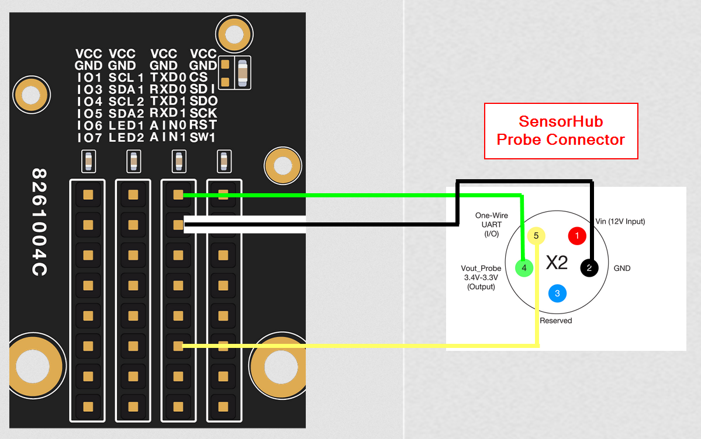
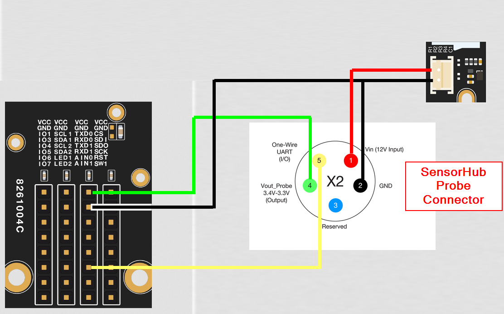

|  |  |  |    
| :-: | :-: | :-: |     

# ⚠️ BETA! ⚠️
This library is still in testing phase!

# Library for RAK-OneWireSerial 

This library provides functions to communicate over a one wire serial interface with slave modules.     
This protocol is used by [RAK2560 SensorHub](https://docs.rakwireless.com/Product-Categories/WisNode/RAK2560/Overview) sensor probes and IO probes. It is as well used to communicate with the [RAK9154 Solar Battery Lite](https://docs.rakwireless.com/Product-Categories/Accessories/RAK9154/Overview/).    

⚠️ This library implements a software half serial communication. It is designed to work with the [WisBlock RAK4631 (Arduino)](https://docs.rakwireless.com/Product-Categories/WisBlock/RAK4631/Overview/) only. ⚠️    

----

# Required hardware
The simpliest hardware configuration to connect to SensorHub Sensor Probes and IO Probes that do not require 12V supply (check the data sheets)    
- RAK19007 WisBlock Base Board
- RAK4631 WisBlock Core Module
- RAK13002 WisBlock IO module
- RAK19002 WisBlock Boost module (if 12V supply is required)

In this configuration, the Sensor Probe is connected with 3.3V, GND and RXD1 only from the RAK13002 module only.    



For Sensor and IO probes that require a 12V supply voltage, an extra supply source is required, e.g. the [RAK19002 Boost Module](https://docs.rakwireless.com/Product-Categories/WisBlock/RAK19002/Overview/).    


----

# Examples

* **[RakOnewireProtocol](./examples/RakOnewireProtocol.in0)** - Using the library to communicate with a SensorHub Sensor or IO Probe    
* **[RAK4631-OneWireSerial](./examples/RAK4631-OneWireSerial)** - PlatformIO example with parsing of the received sensor data    
* **[SoftwareHalfSerialExample](./examples/SoftwareHalfSerialExample.ino)** - Example for the software half serial interface.     

----

# Installation

In Arduino IDE install the library from the library manager. The library can be found in the manager with the searcth term _**RAK-OneWireSerial**_.
For manual installation download the library from [RAK-OneWireSerial](https://github.com/beegee-tokyo/RAK-OneWireSerial) as [ZIP file](https://github.com/beegee-tokyo/RAK-OneWireSerial/archive/refs/heads/main.zip). Unzip it and place the RUI3-Arduino-Library folder into the library directory.
In Arduino IDE this is usually <arduinosketchfolder>/libraries/

In PlatformIO install the library project dependencies by adding

```log
lib_deps =
   beegee-tokyo/RAK-OneWireSerial
```

into **`platformio.ini`**

For the latest, not released version use
```log
lib_deps =
    https://github.com/beegee-tokyo/RAK-OneWireSerial.git
```

----

# SERIAL assignments
The OneWireSerial is a software serial communication. It is preferable used with RX1 (GPIO P0.15) of the RAK4631.     
It should work with other GPIO's as well, but it is not tested.      

# Functions

